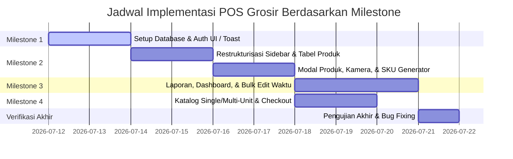

# Rencana Perbaikan POS Grosir (Milestone-based)

Dokumen ini berisi rencana kerja (planning) terperinci untuk melakukan perbaikan dan penambahan fitur pada aplikasi POS Grosir berdasarkan [Referensi Perbaikan.md](file:///d:/Aku%20Skripsi/pos_grosir/Dokumen/Referensi%20Perbaikan.md), yang disusun ke dalam 4 Milestone terarah.

---

## 📌 Milestone Roadmap

### 📦 MILESTONE 1: Autentikasi, Pengalaman Pengguna (UX) Dasar, & Fondasi Database
Fokus pada perbaikan alur registrasi/login, notifikasi toast global, modal konfirmasi logout, dan penyiapan skema database dasar.

- **Autentikasi & Landing Page**:
  - Mengubah tautan kembali ke login di registrasi menjadi: `"Sudah memiliki akun? Masuk"`.
  - Mengubah label field `"No. Telepon"` menjadi `"Nomor Telepon"`.
  - Memperbaiki tombol `"Masuk ke Akun"` di Landing Page agar berfungsi.
  - Mengubah tujuan redirect setelah login customer dari `/` (home) → `/customer/katalog`.
- **Pengalaman Pengguna (UX)**:
  - Menambahkan konfirmasi dialog sebelum logout admin/customer.
  - Integrasi library Toast (misalnya `react-hot-toast` atau `sonner`) untuk notifikasi sukses/error registrasi, login, dan aksi penting lainnya.
  - Menghapus fitur "Pengaturan" sesuai instruksi.
- **Database (`Supabase`)**:
  - Membuat tabel `stock_mutations` untuk melacak riwayat stok produk (mencatat otomatis setiap ada restok, penjualan, atau edit manual).
  - Menambahkan kolom `waktu_pengambilan` (integer) pada tabel produk.

---

### 📦 MILESTONE 2: Manajemen Produk & Stok (Admin Dashboard)
Fokus pada halaman kelola produk, penggabungan sidebar, dan pembuatan modal tambah/edit produk dengan fitur lanjutan.

- **Sidebar Admin**:
  - Menghapus menu "Kelola Stok" dari sidebar admin.
  - Menggabungkan "Kelola Produk" dan "Kelola Stok" menjadi menu terpadu: **"Kelola Produk dan Stok"**.
- **Tabel Kelola Produk (`/dashboard/products`)**:
  - Menghapus kolom "Berat", menambahkan kolom "Stok".
  - Menambahkan pagination di bawah tabel produk.
  - Menambahkan Dropdown Filter Kategori di sebelah Search Bar.
  - Menambahkan tombol "Update Stok" (membuka modal quick-edit untuk ubah/tambah/kurangi stok) dan tombol "📦 History" (melihat riwayat mutasi dari tabel `stock_mutations`) di kolom Aksi.
- **Modal Tambah/Edit Produk**:
  - Menambahkan fitur **Generate SKU** otomatis.
  - Mengubah input satuan menjadi **Select Option** (pilihan dropdown).
  - Menambahkan input **Stok Awal** beserta select option untuk satuannya.
  - Menambahkan checkbox toggle **Single/Multiple Unit** untuk menentukan jenis kemasan produk.
  - Menambahkan fitur **Foto Produk via Kamera Langsung** menggunakan input file kamera (`accept="image/*" capture="environment"`) yang responsif di HP, laptop, dan tablet.
  - Menambahkan field **"Waktu Pengambilan (detik/menit)"** pada form input produk.

---

### 📦 MILESTONE 3: Halaman Laporan, Dashboard Analytics & Kelola Pengambilan
Fokus pada penyajian visualisasi laporan admin, profil admin, serta manajemen waktu pengambilan massal.

- **Laporan & Dashboard Admin**:
  - Menghapus bagian **Evaluasi Antrian** di halaman laporan (`/dashboard/reports`).
  - Menambahkan filter laporan: **Hari Ini**, **Minggu Ini**, dan **Bulan Ini**.
  - Menambahkan grafik visualisasi bulanan dan daftar produk terlaris di halaman utama Dashboard Admin.
  - Menambahkan fitur/halaman Profil khusus untuk Admin.
- **Kelola Waktu Pengambilan (Hybrid)**:
  - Menyediakan menu baru di sidebar dan halaman khusus untuk bulk edit (edit massal) field "Waktu Pengambilan" untuk semua produk secara cepat.

---

### 📦 MILESTONE 4: Katalog & Pemesanan (Customer Side)
Fokus pada antarmuka customer untuk pemilihan unit kemasan dan penanganan validasi stok.

- **Katalog Customer (`/customer/katalog`)**:
  - **Tampilan Produk Multi-Unit**: Menampilkan pilihan kemasan grosir (dropdown), format stok detail (contoh: `Stok: 2 Pack (10 pcs) ⚠️`), dan penanganan stok habis di dropdown (tampilkan opsi kemasan, tetapi **Disabled / Habis**).
  - **Tampilan Produk Single-Unit**: Menampilkan harga per unit secara ringkas (contoh: `Rp 17.000 / dus`) dan status stok dengan ikon/tanda (contoh: `Stok: 15 dus ✅`).
  - Integrasi alur checkout agar otomatis mencatat mutasi stok ke tabel `stock_mutations`.

---

## 🛠️ Jadwal & Estimasi Implementasi

---

## 📊 Rencana Verifikasi per Milestone

### Pengujian Milestone 1
- [x] Memastikan registrasi akun baru memunculkan toast sukses dan teks tombol kembali ke login tertulis "Sudah memiliki akun? Masuk".
- [x] Memastikan login customer langsung diarahkan (redirect) ke `/customer/katalog`.
- [x] Memverifikasi dialog konfirmasi sebelum keluar (logout) muncul dengan benar.
- [x] Memastikan database Supabase memiliki tabel `stock_mutations` dan kolom baru pada tabel produk.

### Pengujian Milestone 2
- [x] Memverifikasi menu di sidebar admin berubah menjadi "Kelola Produk dan Stok".
- [x] Memeriksa tabel produk memiliki pagination, dropdown kategori, dan kolom stok (bukan berat).
- [x] Menguji fitur generate SKU otomatis dan toggle unit di modal produk.
- [x] Menguji pengambilan foto produk menggunakan kamera langsung dari perangkat smartphone dan laptop.

### Pengujian Milestone 3
- [x] Menguji keakuratan filter laporan (Hari Ini, Minggu Ini, Bulan Ini) dan memastikan bagian Evaluasi Antrian sudah terhapus.
- [x] Memverifikasi tampilan grafik bulanan dan produk terlaris di dashboard admin.
- [x] Menguji perubahan massal "Waktu Pengambilan" produk di halaman khusus kelola waktu pengambilan.

### Pengujian Milestone 4
- [x] Menguji rendering kartu produk single-unit vs multi-unit di katalog customer.
- [x] Memastikan opsi kemasan yang stoknya habis di dropdown katalog tampil sebagai disabled (tidak bisa diklik).
- [x] Melakukan pemesanan dan memvalidasi bahwa stok berkurang serta tercatat dengan benar di tabel riwayat mutasi stok.
