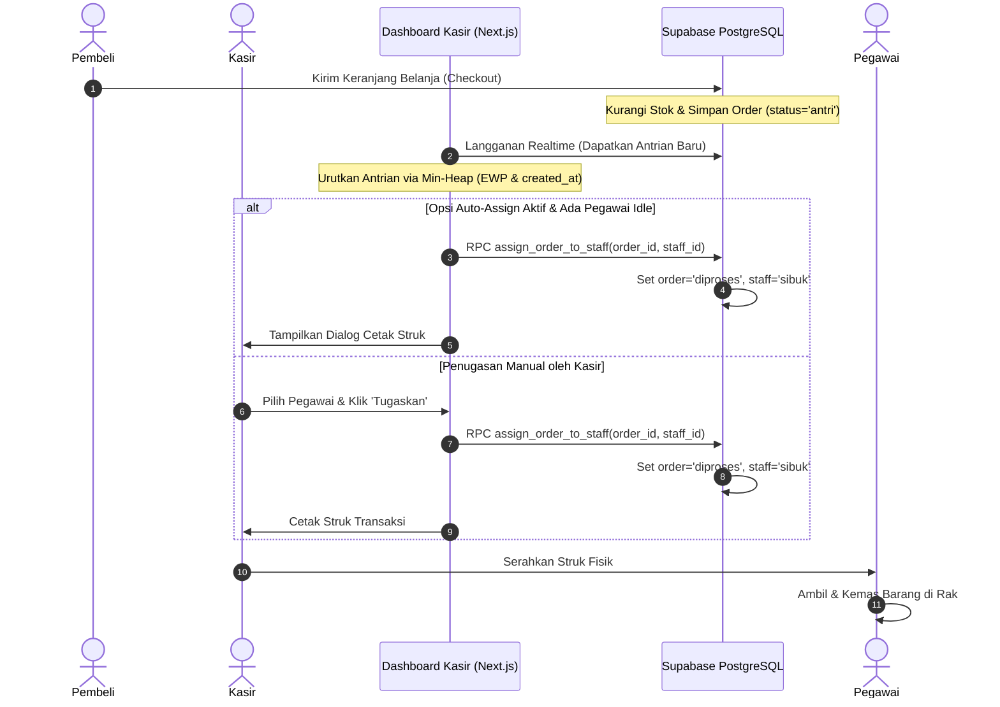
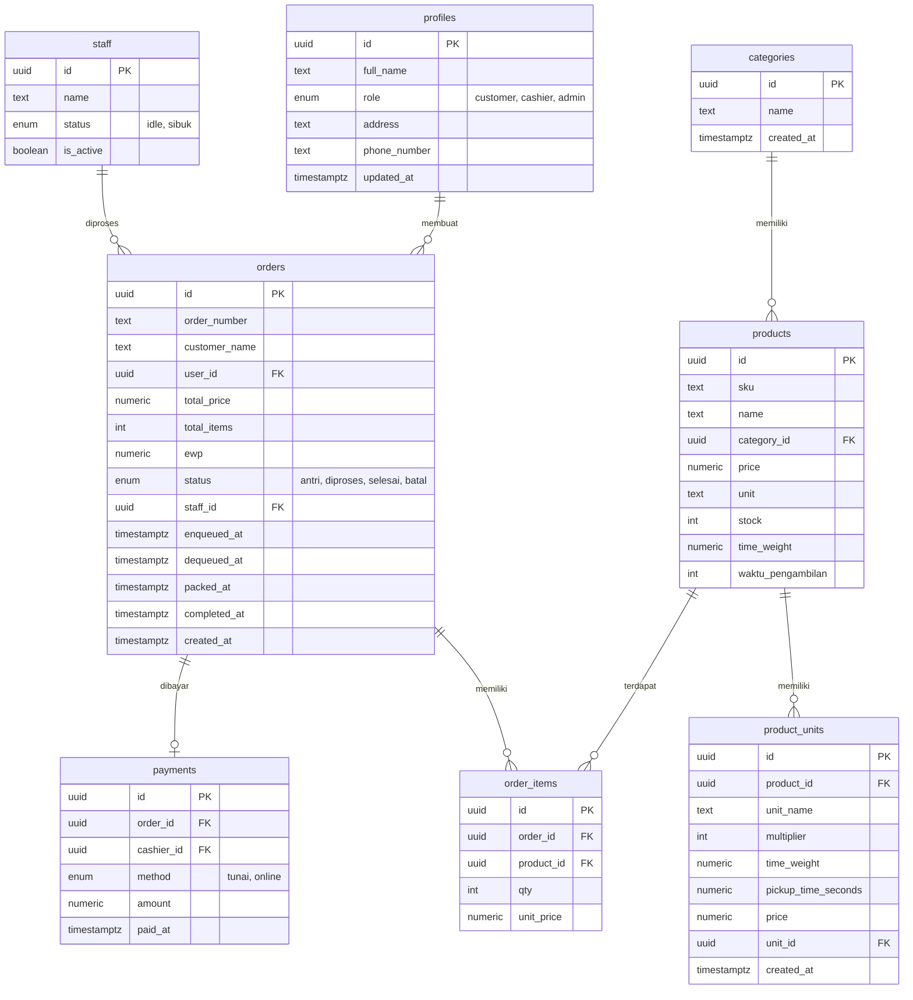

# Rancangan Sistem (Designs & Blueprints)
## Rancang Bangun Sistem Point of Sale Grosir dengan Penerapan Priority Queue pada Antrian Pesanan
**Studi Kasus: Grosir Jasa**

Dokumen ini memuat seluruh rancangan teknis (*designs and blueprints*) dari sistem Point of Sale (POS) Grosir Jasa, mencakup arsitektur sistem, rancangan basis data relasional, diagram UML (Use Case, Sequence, ERD), wireframe antarmuka pengguna, serta skenario pengujian Black Box.

---

## 1. Arsitektur Sistem

Arsitektur sistem dibangun dalam 5 lapisan (*5-tier architecture*) untuk memisahkan tanggung jawab antara interaksi pengguna, pemrosesan logika antrian prioritas, penyimpanan data, dan keluaran yang dihasilkan.

```mermaid
graph LR
    subgraph Aktor [1. Aktor]
        direction TB
        Customer["Pembeli (Customer)"]
        Cashier["Kasir"]
        Admin["Admin"]
    end
    subgraph Input [2. Input]
        direction TB
        InCust["Login, Keranjang, Pesanan"]
        InCash["Struk, Pembayaran"]
        InAdmin["CRUD Produk, Stok, Pengguna"]
    end
    subgraph Proses [3. Proses]
        direction TB
        EWP["Hitung EWP: sum(Q x W)"]
        MinHeap["Min-Heap Priority Queue"]
        Heapify["Heapify-Up & Heapify-Down"]
        Dist["Distribusi Tugas (Single Queue Multiple Server)"]
    end
    subgraph Database [4. Database]
        direction TB
        profiles["Profiles Table (RBAC)"]
        products["Products & Categories"]
        orders["Orders & Items"]
        staff["Staff Status Table"]
    end
    subgraph Output [5. Output]
        direction TB
        QueueDash["Dasbor Antrian Realtime"]
        StatusLive["Status Live Pembeli"]
        Receipt["Struk Kasir & Pembayaran"]
        Report["Grafik Laporan Penjualan"]
    end
    Aktor --> Input
    Input --> Proses
    Proses --> Database
    Database --> Output
```



---

## 2. Diagram UML (Unified Modelling Language)

### 2.1 Use Case Diagram
Use case diagram berikut menjelaskan hubungan interaksi antara 3 aktor (Pembeli, Kasir, Admin) dengan 10 fungsi utama dalam sistem POS Grosir Jasa.

```mermaid
leftToRightDirection
graph TD
    pembeli((Pembeli))
    kasir((Kasir))
    admin((Admin))
    
    subgraph Sistem POS Grosir
        UC1[Login]
        UC2[Registrasi Akun]
        UC3[Melihat Katalog & Stok Real-Time]
        UC4[Membuat Pesanan Digital]
        UC5[Memantau Dasbor Antrian]
        UC6[Mencetak Struk Pesanan]
        UC7[Konfirmasi Pembayaran]
        UC8[Kelola Data Produk & Stok]
        UC9[Kelola Data Pengguna]
        UC10[Lihat Laporan Penjualan]
    end
    
    pembeli --> UC1
    pembeli --> UC2
    pembeli --> UC3
    pembeli --> UC4
    
    kasir --> UC1
    kasir --> UC5
    kasir --> UC6
    kasir --> UC7
    
    admin --> UC1
    admin --> UC8
    admin --> UC9
    admin --> UC10
```

### 2.2 Sequence Diagram: Proses Checkout dan Distribusi Pesanan
Sequence diagram di bawah ini menjelaskan alur pembuatan pesanan oleh pembeli (checkout) beserta delegasi tugas ke pegawai (baik otomatis maupun manual) melalui dasbor kasir dengan visualisasi antrian terurut Min-Heap.



---

## 3. Skema Database & Entity Relationship Diagram (ERD)

Sistem menggunakan basis data relasional PostgreSQL (melalui Supabase) yang terdiri dari 9 tabel utama untuk mendukung integritas data transaksi, inventori, dan log antrian.



### 3.1 Detail Kamus Data & Relasi Tabel

1. **Tabel `profiles`**: Menyimpan data profil pengguna yang terintegrasi dengan `auth.users` Supabase. Hak akses diatur melalui enum `user_role` (`'customer'`, `'cashier'`, `'admin'`).
2. **Tabel `products` & `categories`**: Menyimpan informasi barang dagang grosir. Dilengkapi kolom `time_weight` dan `waktu_pengambilan` untuk menampung bobot waktu pengambilan barang.
3. **Tabel `product_units`**: Menyimpan variasi kemasan grosir (eceran, pak, karton) dengan kolom `multiplier` sebagai faktor perkalian kuantitas ke pcs.
4. **Tabel `orders` & `order_items`**: Menyimpan data pesanan belanja. Nilai prioritas ditentukan oleh kolom `ewp` (Estimasi Waktu Proses) yang dihitung di aplikasi. Total belanja disimpan dalam `total_price` dan statusnya berupa enum `'antri'`, `'diproses'`, `'selesai'`, `'batal'`.
5. **Tabel `staff`**: Menyimpan status ketersediaan 4 orang pegawai (`'idle'` atau `'sibuk'`). Status pegawai dikelola secara real-time via fungsi `assign_order_to_staff` dan `complete_packing`.
6. **Tabel `payments`**: Menyimpan rincian transaksi pembayaran lunas dengan enum `payment_method` (`'tunai'` atau `'online'`).

---

## 4. Rancangan Antarmuka Pengguna (UI Wireframe)

### 4.1 Modul Pembeli: Halaman Katalog & Keranjang Belanja
Halaman katalog dirancang responsif untuk browser mobile agar mempermudah pembeli menyusun daftar belanja digital.

```
+------------------------------------------+
|  [Logo Grosir]                 (Keranjang)|
+------------------------------------------+
|  Cari Produk: [ Rokok                 ]  |
+------------------------------------------+
|  Kategori: [ Semua ] [ Kebutuhan Dapur ]  |
+------------------------------------------+
|  Katalog Produk:                         |
|  +------------------------------------+  |
|  | [Foto] Rokok Surya 16              |  |
|  | Rp 30.000 / Eceran (Stok: 120)     |  |
|  | [ - ] [ 12 ] [ + ]   [ Tambah ]    |  |
|  +------------------------------------+  |
|  | [Foto] Minyak Bimoli 2L            |  |
|  | Rp 38.000 / unit (Stok: Habis)     |  |
|  | [ Stok Habis - Tombol Nonaktif ]   |  |
|  +------------------------------------+  |
+------------------------------------------+
|  [ Katalog ]     [ Transaksi ]    [ Akun ]|
+------------------------------------------+
```

### 4.2 Modul Kasir: Dasbor Antrian Priority Queue (Min-Heap)
Papan antrian real-time yang menyajikan daftar antrian terurut prioritas (EWP terkecil di posisi atas) dan status keempat pegawai secara terpusat.

```
+-----------------------------------------------------------------------------------+
|  DASBOR ANTRIAN PRIORITAS KASIR (REAL-TIME)                          [Admin Area] |
+-----------------------------------------------------------------------------------+
|  [ Antrian Priority Queue ]                                                       |
|  +-----+------------+---------------+------------+--------------+---------------+ |
|  | No. | No. Order  | Nama Pembeli  | Item (Qty) | EWP (Prioritas)| Aksi        | |
|  +-----+------------+---------------+------------+--------------+---------------+ |
|  |  1  | ORD-00342  | Toko Berkah   | 3 jenis(5) | 45 detik     | [Cetak Struk] | |
|  |  2  | ORD-00340  | Zuyyin Zafira | 2 jenis(8) | 70 detik     | [Cetak Struk] | |
|  |  3  | ORD-00341  | Andyka        | 5 jenis(12)| 180 detik    | [Cetak Struk] | |
|  +-----+------------+---------------+------------+--------------+---------------+ |
|                                                                                   |
|  [ Status Pegawai Toko ]                                                          |
|  +-------------------+-------------------+-------------------+------------------+ |
|  | Pegawai 1: BUSY   | Pegawai 2: IDLE   | Pegawai 3: BUSY   | Pegawai 4: IDLE  | |
|  | (ORD-00339)       | (Tersedia)        | (ORD-00338)       | (Tersedia)       | |
|  +-------------------+-------------------+-------------------+------------------+ |
+-----------------------------------------------------------------------------------+
```

---

## 5. Skenario Pengujian Black Box

Pengujian fungsionalitas sistem dirancang menggunakan teknik Black Box Testing untuk memverifikasi kesesuaian antara input pengguna dengan respon yang diberikan sistem.

### 5.1 Skenario Pengujian Login & Registrasi
- **Test Case 1**: Login dengan kredensial terdaftar -> Login berhasil, user diarahkan sesuai *role*.
- **Test Case 2**: Login dengan password salah -> Login gagal, muncul error validasi.
- **Test Case 3**: Registrasi akun pembeli dengan username yang sudah digunakan -> Registrasi ditolak, muncul warning "Username sudah terdaftar".

### 5.2 Skenario Pengujian Katalog & Pemesanan
- **Test Case 1**: Menampilkan stok real-time -> Produk dengan stok = 0 otomatis menampilkan indikator "Stok Habis" dan tombol pemesanan dinonaktifkan.
- **Test Case 2**: Membuat pesanan item melebihi stok -> Transaksi ditolak, muncul pesan "Stok tidak mencukupi".
- **Test Case 3**: Verifikasi kalkulasi EWP -> Memesan 2 unit barang A (W=5 detik) dan 1 unit barang B (W=15 detik) -> EWP terhitung otomatis di database = 25 detik.

### 5.3 Skenario Pengujian Antrian & Distribusi Pegawai
- **Test Case 1**: Memasukkan 3 pesanan baru dengan EWP bervariasi -> Papan antrian kasir memperbarui urutan prioritas terkini secara real-time, menempatkan EWP terkecil di baris paling atas antrian.
- **Test Case 2**: Mengubah status pesanan dari `ANTRI` menjadi `DIPROSES` -> Pegawai yang ditugaskan berubah status menjadi *busy* di dasbor kasir secara real-time.
- **Test Case 3**: Kasir menyelesaikan transaksi pembayaran -> Status pesanan berubah menjadi `SELESAI`, stok produk di database terpotong otomatis sesuai item belanja, dan status pegawai kembali berubah menjadi *idle* (siap menerima pesanan baru).
