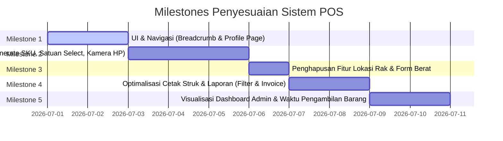

# Rencana Tindak Lanjut & Planning Penyesuaian Sistem POS Grosir
**Studi Kasus: POS Grosir Jasa**

Dokumen ini memuat rencana kerja penyesuaian sistem Point of Sale (POS) Grosir Jasa berdasarkan daftar evaluasi dan saran pengembangan terbaru. Pekerjaan dibagi menjadi beberapa milestone terstruktur untuk memastikan pengerjaan yang rapi dan terukur.

---

## 📌 Ringkasan Rencana Kerja (Milestones)



---

## 📦 Milestone 1: Peningkatan UI & Navigasi Dashboard
Fokus pada standarisasi navigasi header dan penyediaan halaman profil pengguna yang saat ini belum diimplementasikan.

### 1. Dynamic Breadcrumb Header
* **Tujuan**: Mengganti teks statis "Documents" di header dengan Breadcrumb dinamis yang melacak rute aktif.
* **Perubahan Berkas**:
  * [MODIFY] `components/site-header.tsx`
* **Strategi**:
  * Menambahkan directive `"use client"` di `site-header.tsx`.
  * Menggunakan hook `usePathname` dari `next/navigation` untuk memotong segment URL (mis. `/dashboard/products` menjadi `['dashboard', 'products']`).
  * Melakukan mapping ke nama label yang ramah pengguna (contoh: `products` -> `Kelola Produk`, `inventory` -> `Kelola Stok`).
  * Merender komponen `Breadcrumb` bawaan shadcn UI (`components/ui/breadcrumb.tsx`).

### 2. Fitur Profil Pengguna (New Screen)
* **Tujuan**: Menyediakan layar bagi pengguna (Admin/Kasir/Pelanggan) untuk melihat dan memperbarui data profil mereka sendiri.
* **Perubahan Berkas**:
  * [NEW] `app/dashboard/profile/page.tsx`
  * [MODIFY] `components/nav-user.tsx`
* **Strategi**:
  * Menambahkan tombol "Profil Saya" di dropdown menu `components/nav-user.tsx` yang mengarah ke `/dashboard/profile`.
  * Membuat halaman profil di `/dashboard/profile` yang memuat form berisi data:
    * **Informasi Akun**:
      * Nama Lengkap (editable)
      * E-mail (read-only dari Auth)
      * Nomor Telepon (editable)
      * Alamat Lengkap (editable)
      * Peran / Role (read-only: Admin/Kasir/Pelanggan)
      * Tombol: Simpan Perubahan
    * **Keamanan Akun**:
      * Password Lama
      * Password Baru
      * Konfirmasi Password Baru
      * Tombol: Ubah Password
  * Menghubungkan form Informasi Akun dengan Supabase DB untuk memperbarui tabel `profiles` menggunakan ID user aktif.
  * Menghubungkan form Keamanan Akun dengan API Auth Supabase untuk memperbarui password setelah memverifikasi password lama.

---

## 🛠️ Milestone 2: Penyempurnaan Form Produk & Kamera Langsung
Mengoptimalkan pengalaman input data produk dengan penambahan otomasi dan integrasi perangkat keras (kamera).

### 1. Fitur Auto-Generate SKU
* **Tujuan**: Kasir/Admin dapat menghasilkan kode SKU secara otomatis tanpa perlu mengetik manual.
* **Perubahan Berkas**:
  * [MODIFY] `app/dashboard/products/page.tsx`
* **Strategi**:
  * Menambahkan tombol "Generate" di sebelah input field SKU pada modal tambah produk.
  * Mengimplementasikan fungsi pembuat SKU berbasis timestamp dan karakter acak (contoh: `PRD-${Date.now().toString().slice(-6).toUpperCase()}`).

### 2. Pilihan Satuan Menggunakan Select Option
* **Tujuan**: Menghindari inkonsistensi penulisan satuan produk (misal: "Pcs", "pcs", "PC") dengan mengubah input teks menjadi dropdown.
* **Perubahan Berkas**:
  * [MODIFY] `app/dashboard/products/page.tsx`
* **Strategi**:
  * Mengubah komponen `<Input>` pada field Satuan (`unit`) menjadi komponen `<Select>`.
  * Menyediakan opsi standar grosir: `pcs`, `pack`, `dus`, `karton`, `slop`, `kg`, `liter`, `box`.

### 3. Foto Produk Menggunakan Kamera HP Langsung
* **Tujuan**: Memudahkan pengisian foto produk saat diakses melalui smartphone dengan langsung mengaktifkan kamera bawaan.
* **Perubahan Berkas**:
  * [MODIFY] `app/dashboard/products/page.tsx`
* **Strategi**:
  * Di samping input file tradisional, ditambahkan tombol "Ambil Foto (Kamera)".
  * Tombol ini memicu input file bertipe image dengan atribut `capture="environment"` (mengaktifkan kamera belakang HP secara langsung).
  * Struktur JSX:
    ```tsx
    <input 
      type="file" 
      accept="image/*" 
      capture="environment" 
      onChange={handleCameraCapture} 
      className="hidden" 
      id="camera-input" 
    />
    ```

---

## 🗑️ Milestone 3: Simplifikasi Kebutuhan Data (Hapus Rak & Berat)
Pembersihan fitur yang tidak lagi diperlukan oleh proses bisnis Grosir Jasa.

### 1. Penghapusan Fitur "Lokasi Rak"
* **Tujuan**: Menghilangkan seluruh masukan, pencatatan, dan tampilan "Lokasi Rak".
* **Perubahan Berkas**:
  * [MODIFY] `app/dashboard/inventory/page.tsx`: Hapus kolom "Lokasi Rak" di tabel inventori dan input lokasi di dialog edit.
  * [MODIFY] `app/dashboard/picking/page.tsx`: Hapus kolom "Lokasi Rak" di checklist gudang kasir/staff.
  * [MODIFY] `app/dashboard/products/page.tsx`: Hapus penetapan lokasi default `"A1"` saat inisialisasi inventori produk baru.

### 2. Penghapusan Field Berat di Modal Produk Baru
* **Tujuan**: Menghapus field "Berat" dari modal Tambah Produk Baru guna mempercepat input produk yang tidak berpatokan pada berat fisik.
* **Perubahan Berkas**:
  * [MODIFY] `app/dashboard/products/page.tsx`
* **Strategi**:
  * Menghapus input field `weight` di form modal dialog tambah/edit produk.
  * Menyimpan data payload weight sebagai `null` secara default saat dikirim to Supabase.

---

## 🧾 Milestone 4: Cetak Struk & Pembaharuan Laporan (Filter & Invoice)
Fokus pada fungsionalitas pencetakan transaksi dan pelaporan penjualan.

### 1. Perbaikan Tampilan Struk Tidak Bisa Scrollable (Bug Fix)
* **Tujuan**: Memastikan komponen dialog struk belanja di layar dapat di-scroll secara vertikal jika produk yang dibeli sangat banyak, tanpa mengacaukan layout cetak (`window.print`).
* **Perubahan Berkas**:
  * [MODIFY] `components/receipt.tsx`
  * [MODIFY] `app/dashboard/cashier/page.tsx`
* **Strategi**:
  * Menambahkan batasan tinggi maksimal pada dialog cetak struk di layar (`max-h-[80vh] overflow-y-auto`) agar pengguna dapat scroll ke bawah untuk melihat keseluruhan struk dan menekan tombol cetak.
  * Memastikan media CSS print (`@media print`) mempertahankan properti `overflow: visible` and `height: auto` agar hasil cetakan fisik thermal tidak terpotong atau memunculkan scrollbar.

### 2. Fitur "Lihat Invoice" di Laporan Penjualan
* **Tujuan**: Memungkinkan pengelola toko melihat ulang struk penjualan dari transaksi masa lalu langsung dari menu laporan.
* **Perubahan Berkas**:
  * [MODIFY] `app/dashboard/reports/page.tsx`
* **Strategi**:
  * Menambahkan kolom "Aksi" pada tabel Transaksi Penjualan.
  * Menambahkan tombol "Lihat Invoice" (ikon mata atau printer) di baris transaksi laporan penjualan.
  * Ketika diklik, tombol akan mengambil detail item order dari database dan menampilkan komponen `Receipt` di dalam modal popup Dialog baru.

### 3. Filter Tanggal Cepat (Hari Ini, Minggu Ini, Bulan Ini)
* **Tujuan**: Mempercepat proses filtering laporan tanpa harus memilih tanggal kalender secara manual.
* **Perubahan Berkas**:
  * [MODIFY] `app/dashboard/reports/page.tsx`
* **Strategi**:
  * Menambahkan grup tombol filter cepat di atas filter tanggal.
  * Tombol ini akan otomatis memperbarui state `startDate` dan `endDate` berdasarkan rentang waktu saat ini:
    * **Hari Ini**: Awal hari ini s/d akhir hari ini.
    * **Minggu Ini**: Awal minggu (Senin) s/d hari ini.
    * **Bulan Ini**: Tanggal 1 bulan berjalan s/d hari ini.

### 4. Penghapusan Fitur "Evaluasi Antrian"
* **Tujuan**: Menghapus modul komparatif FIFO vs Priority Queue di laporan karena pengujian akademik dipindahkan atau disederhanakan.
* **Perubahan Berkas**:
  * [MODIFY] `app/dashboard/reports/page.tsx`
* **Strategi**:
  * Menghapus tab `evaluation` dari komponen `TabsList`.
  * Menghapus komponen `TabsContent value="evaluation"` beserta kode generator simulasi beban (`handleRunSimulation`) dan recharts yang terkait.

---

## 📈 Milestone 5: Visualisasi Dashboard & Waktu Pengambilan Barang

### 1. Visualisasi Grafik Bulanan & Produk Terlaris di Dashboard Admin
* **Tujuan**: Memberikan insight visual langsung mengenai tren penjualan bulanan dan produk terlaris kepada admin toko.
* **Perubahan Berkas**:
  * [MODIFY] `app/dashboard/page.tsx`
* **Strategi**:
  * **Grafik Pendapatan Bulanan**: Menambahkan query ke Supabase untuk mengelompokkan data penjualan (`payments`) berdasarkan bulan dalam 6 bulan terakhir, kemudian divisualisasikan menggunakan LineChart atau BarChart dari `recharts`.
  * **Grafik Produk Terlaris (Top Selling)**: Menambahkan query agregasi dari `order_items` untuk menghitung kuantitas kumulatif terjual per produk, diurutkan terbesar, dan merender grafik horizontal BarChart untuk 5 produk teratas.

### 2. Fitur Kelola Waktu Pengambilan Barang (New Screen)
* **Tujuan**: Admin dapat mengatur estimasi waktu pengambilan (`time_weight`) spesifik untuk setiap unit produk, yang akan memengaruhi nilai ECT (Estimasi Completion Time) dalam sistem antrean prioritas.
* **Perubahan Berkas**:
  * [NEW] `app/dashboard/picking-time/page.tsx`
  * [MODIFY] `components/app-sidebar.tsx`
* **Strategi**:
  * Menambahkan menu "Waktu Pengambilan" pada sidebar admin.
  * Membuat halaman kelola waktu pengambilan di `/dashboard/picking-time` yang menampilkan tabel produk beserta data relasi unit kemasannya (`product_units`).
  * Admin dapat menyunting nilai `time_weight` (dalam menit) untuk setiap unit produk (misal: Pcs = 0.1 menit, Pack = 0.5 menit, Dus = 1.5 menit) dan menyimpannya langsung ke database Supabase.

---

## 🔍 Rencana Verifikasi (Testing Plan)

Setelah penyesuaian dilakukan, verifikasi akan dilakukan dengan skenario berikut:
1. **Verifikasi Breadcrumb**: Pindah-pindah halaman dashboard dan pastikan navigasi breadcrumb sinkron dengan URL aktif.
2. **Uji Generate SKU & Satuan Select**: Buka modal tambah produk, klik generate SKU, pilih satuan dari dropdown, lalu pastikan produk berhasil disimpan.
3. **Uji Kamera HP**: Akses modal produk dari mobile device (HP/tablet), klik tombol kamera, dan pastikan kamera HP aktif.
4. **Verifikasi Penghapusan Lokasi Rak & Berat**: Pastikan tabel inventori, picking, dan modal tambah produk bersih dari field lokasi rak dan berat produk.
5. **Uji Cetak Struk**: Masukkan transaksi dengan 15+ item di halaman Kasir. Buka struk belanja di layar, pastikan dapat di-scroll vertikal dan saat dicetak (`window.print`) seluruh item keluar dengan rapi.
6. **Uji Filter Laporan & Invoice**: Klik tombol "Minggu Ini" di laporan dan pastikan data terfilter otomatis. Klik "Lihat Invoice" pada salah satu baris pembayaran, lalu verifikasi kesesuaian data nota.
7. **Verifikasi Visualisasi & Waktu Pengambilan**: Buka Dashboard Admin dan pastikan grafik bulanan serta produk terlaris ter-render dengan benar. Buka menu Waktu Pengambilan, ubah data `time_weight` produk, dan pastikan nilai tersimpan di database.
